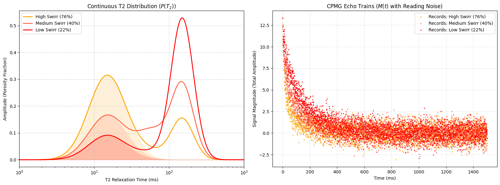

# RMN Synthetics Data: Constructing a Synthetic NMR Echo Data from volumetric well-logging

This project provides an analytical and computational pipeline for generating raw synthetic Nuclear Magnetic Resonance (NMR) echo train signals from volumetric well-logging data, such as `MPHI`, `MBVI`, and `PHIX`.

## Authors

- Arick Jurdan
- Lorena Mamede

## Objective

The main objective of this project is to reconstruct the magnetization decay $M(t)$ so that it rigorously reflects the physics of the rock's irreducible water saturation ($S_{wirr}$). This allows for the creation of realistic and controlled synthetic datasets that can be used as a theoretical baseline or to train and validate predictive algorithms and Deep Learning models applied to petrophysics.

## Methodology and Approach

The methodology is based on the physical forward modeling of the NMR signal, bridging macroscopic well-logging measurements to the quantum mechanics of proton decay through the following steps:

1. **Pore-filling definition:** The volume derived from conventional petrophysical logs defines the initial distribution. The `MBVI` index dictates the exact area under the curve associated with micropores (short relaxation times). The free fluid (calculated by the difference between `MPHI` and `MBVI`) dictates the area corresponding to macropores (long relaxation times) [1]
2. **Statistical Pore Modeling:** The pore space is synthesized by imposing continuous log-normal distributions in the transverse relaxation time ($T_2$) domain, parameterized to reflect the natural heterogeneity of the rock matrix.
3. **Ideal Magnetization Decay:** The magnetization signal is computed and simulated by applying a multi-exponential decay matrix (forward modeling) over the generated $T_2$ distributions.

$$
M(t) = \int P(T_{2}) \exp \left( - \frac{t}{T_{2}} \right)
$$

## Assumptions

1. Pore size and its physical behavior follow a **log-normal distribution** [2] (the statistical parameters of mean and standard deviation can be extracted and adjusted from classical petrophysics literature based on the local lithology).
2. The system is modeled containing **only a single fluid** filling the pores (water), eliminating the complex polarization and relaxation effects due to the presence of lighter fluids, such as gas or oil.
3. The data comes from reservoirs with similar sedimentary and lithological properties. This ensures that the hyperparameters of the constructed log-normal model can be consistent and generalized for the entire dataset.

## Repository Structure

### 1. `data/preprocessing.ipynb`

Script responsible for loading and preparing the raw well-log data.

- Initializes the source data from local spreadsheets (e.g., `GulfCoast_NMR.xlsx`).
- Performs a sample crop by defining the target depth window (e.g., rows between 960 and 1536).
- Calculates two approximations for the **Irreducible Water Saturation** column: ($S_{wirr} = \frac{MBVI}{MPHI}$ and $S_{wirr} = \frac{MBVI}{PHIX}$).
- Processes the columns of interest (`PHIX`, `MBVI`, `MPHI`, `Swirr_PHIX`), reordering the table into a sequence compatible with the synthetic processing pipeline and exporting the result.

obs: here we assume the `Swirr_PHIX`as "ground truth" value for water saturation.

### 2. `NMRSynthData.ipynb`

The main notebook that centralizes the processing and final synthesis:

- Contains the Exploratory Data Analysis (EDA) of the filtered logs.
- Provides the decay functions and modeling equations for the NMR domain.

## References

1. Coates, G.R., Xiao, L., and Prammer, M.G. (1999). _NMR Logging Principles and Applications_ . Halliburton Energy Services, (chapters detailing the Coates and SDR permeability models and **$T_2$** cutoffs).
2. Howard, J.J., Kenyon, W.E., and Straley, C. (1993). _Proton magnetic resonance and pore size variations in reservoir sandstones_ . SPE Formation Evaluation, 194-200.
3. [Gulf of Mexico Gas Hydrate Dataset](https://www.usgs.gov/publications/gulf-mexico-gas-hydrate-joint-industry-project-leg-ii-logging-while-drilling-data): Collett, T. S., Lee, M. W., Zyrianova, M. V., Mrozewski, S. a., Guerin, G., Cook, A. E., and Goldberg, D. S. (2012). _Gulf of Mexico Gas Hydrate Joint Industry Project Leg II logging-while-drilling data acquisition and analysis. Marine and Petroleum Geology_ (DOI: 10.1016/j.marpetgeo.2011.08.003).
4. [Open-Source-Petrophysics](https://github.com/Philliec459/Open-Source-Petrophysics) by Craig Phillips - _Open-source repository focused on subsurface data analysis tools._
5. [synthetic_well-log_polynomial_regression](https://github.com/abhishekdbihani/synthetic_well-log_polynomial_regression) by Abhishek Bihani - _ML project for constructing missing well-logs from other existing physical evaluations._

## Citation

Reis, A., & Mamede Botelho, L. (2026). Nuclear Magnetic Resonance Synthetics Dataset from Gulf of Mexico Gas Hydrate [Dataset]. [https://doi.org/10.5281/zenodo.22097128](https://doi.org/10.5281/zenodo.22097128)
